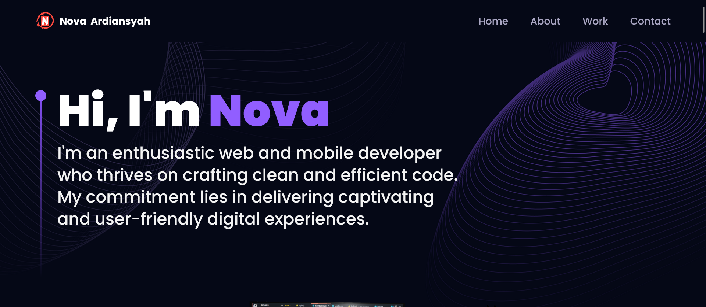
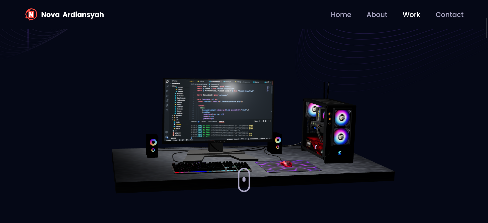
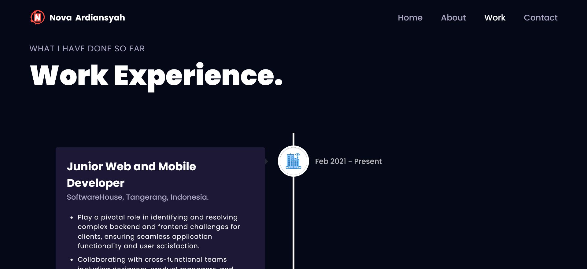
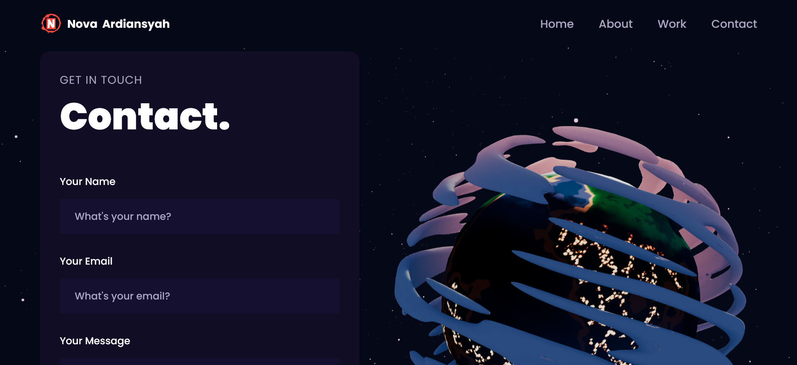

# Vite 3D Portfolio

Hi Future Developer!

Welcome to my latest project! This time, I've crafted a webpage that exudes modernity and sophistication, packed with intriguing features. This project is a portfolio website built using Next.js technology, adorned with captivating 3D models created using Three.js. Supported by Tailwind CSS framework, the visual aesthetics of this website are truly captivating.

*\* This isn't my live portfolio – it's a project I've designed to enrich my web development experience.*

*Thank you for your interest. Happy coding!*

## Powering Up with Tech Stack! ⚡

This project is fueled by an electrifying lineup of technologies:
- [NextJs](https://nextjs.org/) - Unleash the power of modern web development.
- [TailwindCss](https://tailwindcss.com/) - Craft stylish and responsive interfaces effortlessly.
- [Framer Motion](https://www.framer.com/motion/) - Elevate user experience with captivating animations
- [ThreeJs](https://threejs.org/) - Create stunning 3D graphics in the browser.

Prepare for an exhilarating ride through innovation and efficiency with this impressive tech stack!

## Licensing Groove🕺

Exciting news! This project is grooving to the rhythm of the [MIT License](https://github.com/novaardiansyah/vite-3d-portfolio/blob/main/LICENSE)! 🎉

## Let's Connect! 📞

Need to chat? Feel free to drop me a line via [Email](mailto:novaardiansyah78@gmail.com) or hit me up on  [Whatsapp](https://wa.me/6289506668480?text=Hi%20Nova,%20I%20have%20a%20question%20about%20your%20Vite%203D%20Portfolio) I'm just a message away, ready to groove with you! 📩

## Sneak Peek 🌟

Get a glimpse of the app's enchanting world by exploring the current progress at [https://vite-3d-portfolio.novaardiansyah.site/](https://vite-3d-portfolio.novaardiansyah.site/). Feast your eyes on these snapshots that showcase the app's dynamic essence:

  
  

  
  

## Project Status 🚀 

